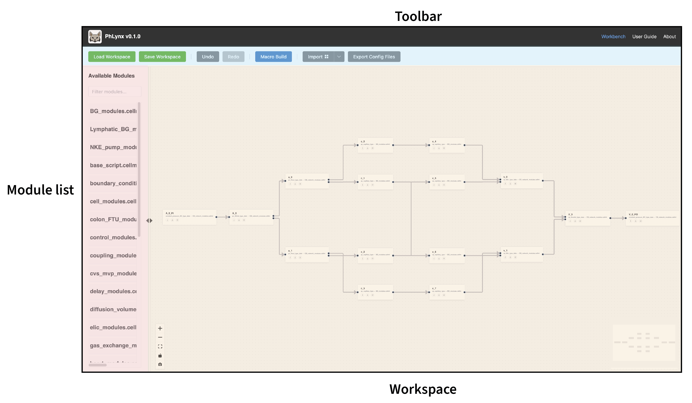
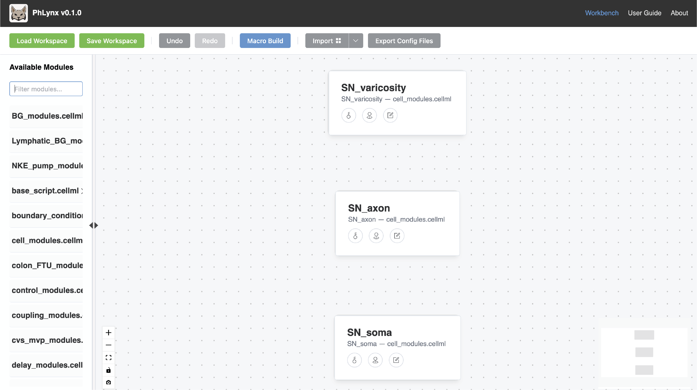
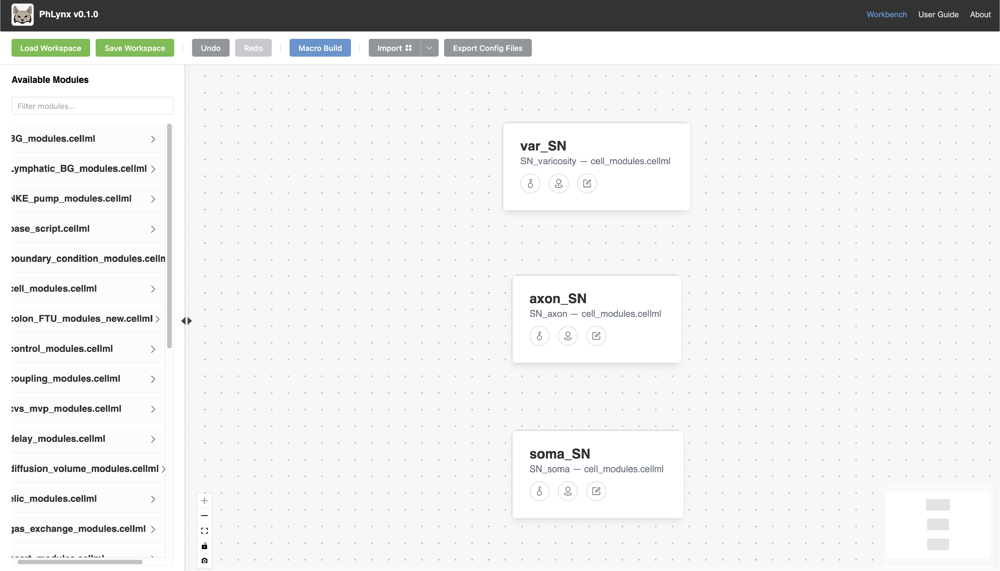
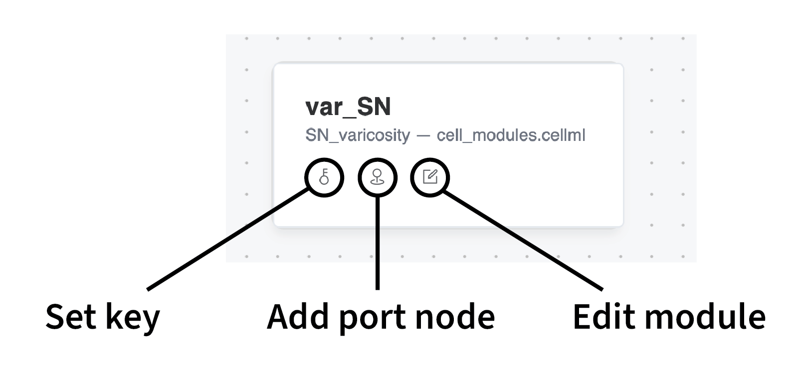
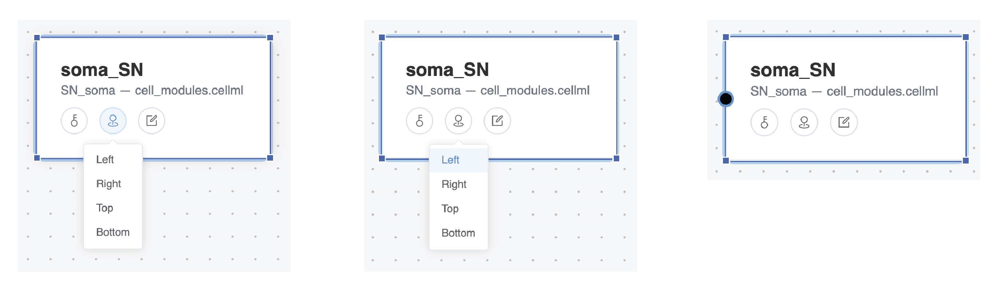
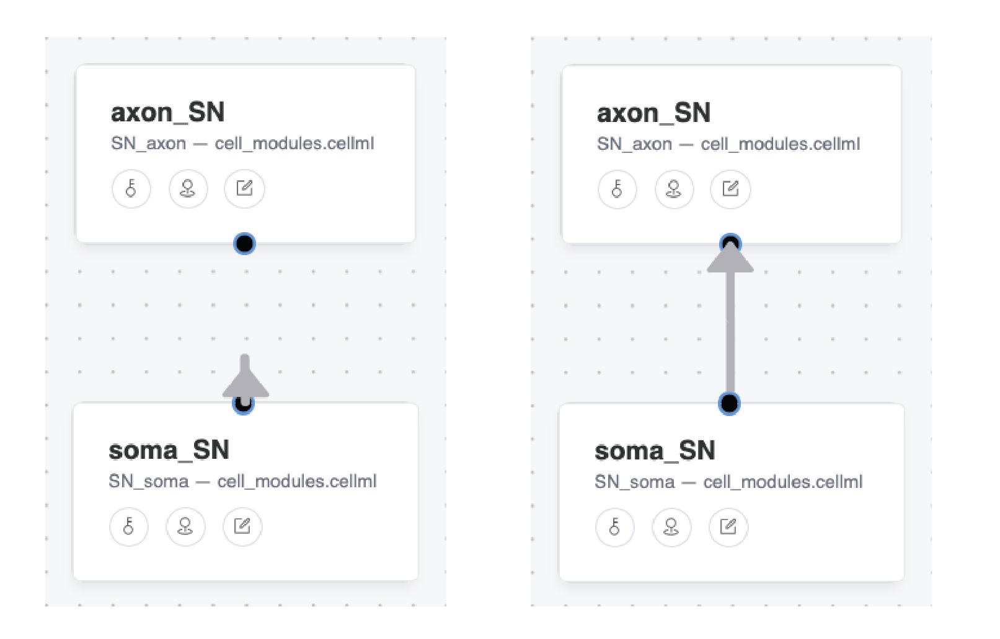
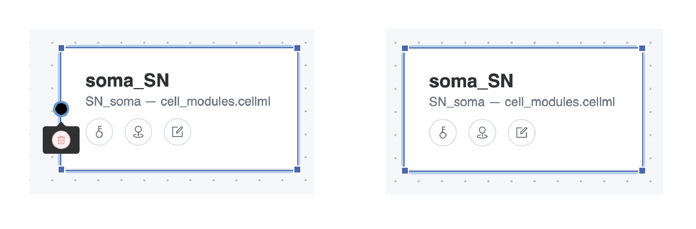
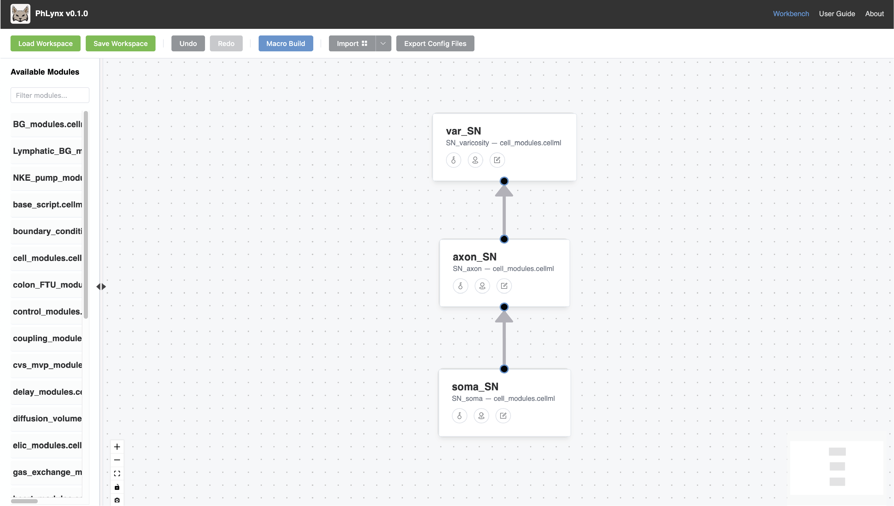
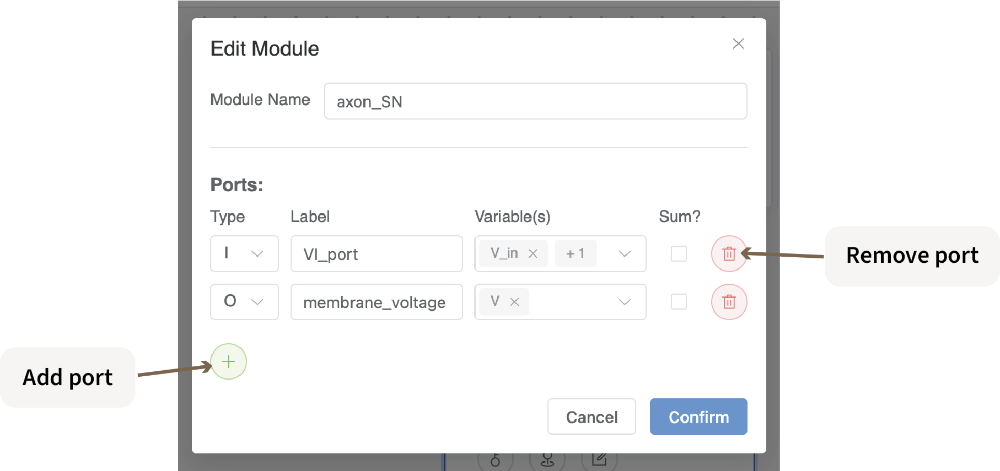

# Quick Start Guide

This guide demonstrates some of PhLynx's core capabilities by walking through the creation of a basic system model.

## Overview

By the end of this tutorial, you will be able to:
- Navigate the PhLynx interface.
- Place, configure, and connect modules.
- Export a combined system model for simulation.

## Workbench Layout

Before building, familiarize yourself with the three main interaction areas of the <GlossaryLink term="Workbench"/>:

- **[Toolbar](../reference/ui-overview#toolbar) (Top):** Controls for file management and workspace operations.
- **[Module List](../reference/ui-overview#module-list) (Left):** Library of imported <GlossaryLink term="modules"/>.
- **[Workspace](../reference/ui-overview#workbench) (Centre):** The canvas for assembling your model.

{.align-center min-width="600px"}

> [!NOTE]
> See the [UI Overview](../reference/ui-overview) for a comprehensive description of all interface components.

## Building a Model

PhLynx includes a library of modules describing various physiological processes. We will use a selection of these modules to assemble a simple system.

> [!NOTE]
> To learn how to import custom modules, see [Making Your Own Modules](../guides/build-custom-module.md).

### Placing Modules

The **Module List** features a search bar to locate specific components. To add a module to the <GlossaryLink term="Workspace"/>, drag and drop it from the list onto the canvas.

#### Step 1: Place and Rename
1.  Search for and drag the following modules onto your Workspace: **SN_soma**, **SN_axon**, and **SN_varicosity**.
    
    {.align-center width="800px"}

2.  Double-click each module node to rename them as follows:
    * Rename **SN_soma** to **soma_SN**
    * Rename **SN_axon** to **axon_SN**
    * Rename **SN_varicosity** to **var_SN**

    {.align-center width="800px"}

    *Note: The original component name and source file remain visible beneath the custom name.*

### Connecting Modules

Modules interact via specific tools located on the module node itself.

{.align-center width="600px"}

* **[Key](../reference/ui-overview#key) (Left):** Assigns a color for visual identification.
* **[Add Port Node](../reference/ui-overview#add-port-node) (Centre-left):** adds a <GlossaryLink term="port-node"/> connection point.
* **[Edit Module Configuration](../reference/ui-overview#edit-module) (Centre-right):** Opens the configuration dialog.
* **[Edit CellML](../guides/writing-cellml) (Right):** Opens the CellML text editor. 

**Managing Connections**
To connect two modules, both must have at least one **Port Node**.

1.  **Add Port Node:** Click the central pin icon and select a position (Top, Bottom, Left, Right).
    {.align-center width="800px"}

2.  **Connect Port Nodes:** Click and drag from one port node to another to create a connection arrow.
    {.align-center width="550px"}

3.  **Remove Port Node:** Hover over an existing node and click the trash icon.
    {.align-center width="550px"}

#### Step 2: Connect
Connect the modules placed in [Step 1](#step-1-place-and-rename) as shown below.

{.align-center width="800px"}

> [!NOTE]
> While this example uses unique ports for each connection, multiple arrows can share a single port node.

### Editing Modules

Before exporting, the model requires specific data configuration. Click the **Edit Module** (pencil) icon to open the configuration dialog.

{.align-center width="800px"}

Use this dialog to define <GlossaryLink term="ports"/>—collections of variables shared between connected modules. A port definition consists of:

* **Type:** Directionality of the port. Input (I), Output (O), or General (G). See [Valid Port Configurations](../reference/valid-port-configurations.md).
* **Label:** The shared name for the variable. This label must match the connected port's label on the target module.
* **Variable(s):** The internal CellML variable(s) associated with this port.
* **Sum?:** Toggles whether this port sums values from multiple connections (e.g., summing transmembrane flux from multiple channels).

#### Step 3: Configure Ports
Configure the ports for each module using the tables below:

**1. var_SN**
| Type | Label | Variable(s) | Sum? |
| :--- | :--- | :--- | :--- |
| Input | membrane_voltage | V | No |
| Output | synaptic_NE | NE | No |

**2. axon_SN**
| Type | Label | Variable(s) | Sum? |
| :--- | :--- | :--- | :--- |
| Input | VI_port | V_in, I | No |
| Output | membrane_voltage | V | No |

**3. soma_SN**
| Type | Label | Variable(s) | Sum? |
| :--- | :--- | :--- | :--- |
| Input | i_stim | I_in | No |
| Output | VI_port | V, I_out | No |

## Saving and Restoring

**Save Workspace**
Click the **Save Workspace** button in the Toolbar (top-left) to download a JSON file of your current state. This preserves module positions, port definitions, and connections.

**Test Restore**
To verify your save file:
1.  Select all modules (Hold `Shift` + Drag to box-select).
2.  Press `Delete` to clear the workspace.
3.  Click **Load Workspace** and select your downloaded JSON file.
4.  The model will be restored to its previous state.

## Exporting

Once the model is built and configured, export the final system. Click the arrow on the **Export** button (Toolbar right).

**Export Options:**
* **CellML:** Generates a flattened CellML 2.0 model file.
* **Configuration Files:** Generates a ZIP archive containing `vessel_array.csv` and `module_config.json` for Circulatory Autogen.

Select **CellML** to save the model to your Downloads folder.

> [!NOTE]
> Chrome users will be prompted to select a save location. Other browsers may default to the Downloads folder.

## Simulating

To verify your new model:

1.  Navigate to [Web OpenCOR](https://opencor.ws/app).
2.  Drag and drop your exported CellML file into the window.
3.  Press the **Play** button (top-left) to run the simulation.

You have now successfully created, exported, and simulated a PhLynx model. 

For more advanced topics, refer to the **Guides** and **Reference** sections of this documentation.