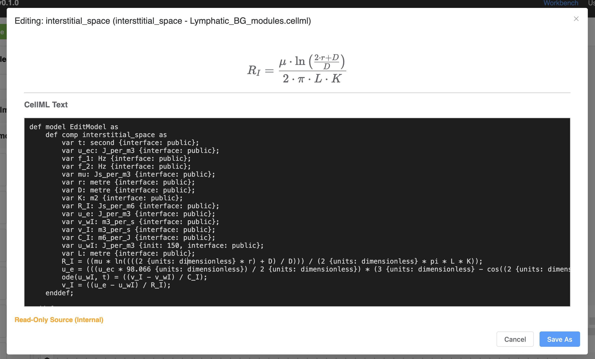

# Writing CellML Guide

The modules used in PhLynx are written in <GlossaryLink term="CellML"/>, a structured text format for storing and sharing computer-based mathematical models. CellML facilitates module coupling due to its emphasis on unit consistency. 

PhLynx contains a simple text-based editor for users to modify modules directly within the application. The following document provides a primer on how to write and edit CellML text in PhLynx.

## CellML Text

Native CellML is based on XML, a format that is excellent for machines but verbose and difficult for humans to read. To address this, IDEs such as OpenCOR—and now PhLynx—use an abstracted format called **CellML Text**. This allows you to write mathematical models using familiar, code-like syntax (e.g., `a = b + c;`) which the software automatically converts into the underlying XML.

## Using the CellML Editor

To open the editor, click the **CellML** icon button on the right of any module node in the workspace.

{.align-center width="600px"}

This opens the **CellML Text Editor** dialog.

{.align-center width="600px"}

There are three main components to this dialog:
1.  **Header:** Displays the name of the module being edited and its source file.
2.  **Equation Viewport:** A dynamic preview pane that renders the math equations visually when your cursor is active on a line of code.
3.  **Text Editor:** The main dark window where you write your code.

> [!TIP]
> **Saving Changes:** 
>* If you are editing a **Custom Module**, clicking `Save` updates the file directly.
> * If you are editing a **Library Module**, you must click `Save As`. This creates a copy of the module in the `UserModules.cellml` container in your Module List, leaving the original library version untouched.

## Writing CellML Text

For those experienced with the text editor of legacy OpenCOR, PhLynx will feel familiar, though there are differences. PhLynx is built on **CellML 2.0**, which simplifies connection logic (concepts like "input" vs "public interface" directionality are unified). 

### Units

Typically, custom units are declared at the top of a CellML file. However, PhLynx centralises unit definitions for the most commonly used biological units to keep module files clean. 

If your module requires a specific unit not found in the PhLynx internal library, you must import a custom units file (see [CellML Specification](https://www.cellml.org/specifications/archive/20030930/units.pdf)).

### Module Structure

Modules in PhLynx follow a standard nesting structure:

```bash
def model [model_name] as
    def comp [module_name] as
        
        [Your Variable Declarations]

        [Your Equations]

    enddef;
enddef;
```

> [!NOTE] 
> Currently, the def model and def comp wrappers are required. Future versions of PhLynx may remove this requirement to simplify the view further.

### Declaring Variables

Before using a variable in an equation, you must declare it. A declaration includes the variable's name, its units, and optional properties like an initial value or interface status.

**Syntax:**

```bash
var [name]: [units] {init: [value], interface: [public]};
```

**Examples:**

```bash
// A constant internal parameter
var R: J_s_per_m6 {init: 8.5}; 

// A variable exposed to other modules (a Port)
var u_e: J_per_m3 {init: 150, interface: public};

// A standard variable calculated within this module
var flow: m3_per_s;
```

**Key Components:**
* `var`: The keyword to start a declaration.
* `init: [value]`: Sets the starting value (required for constants and state variables).
* `interface: public`: Exposes this variable as a Port on the module node, allowing it to be connected to other modules.

### Writing Equations

Equations in CellML Text are written using standard mathematical notation. All equations must end with a semicolon `;`.

#### Algebraic Expressions
You can use standard arithmetic operators (`+`, `-`, `*`, `/`) and common mathematical functions (`sin`, `cos`, `exp`, `log`, `sqrt`, `power`).

**Example**:
```bash
// Ohm's law for fluid flow
flow = (u_in - u_out) / R;

// Calculating area from a radius variable
area = 3.14159 * power(radius, 2);
```
> [!WARNING] 
> Ensure that the units on the Left Hand Side (LHS) of the equation match the calculated units on the Right Hand Side (RHS). CellML enforces dimensional consistency.

#### Ordinary Differential Equations (ODEs)

ODEs describe how a variable changes over time. To define a differential equation, you must first declare a variable representing time.

**1. Declare Time Variable:**

```bash
var t: second;
```

**2. Define the ODE:**

Use the `ode(variable, independent_variable)` syntax.

**Example:**
```bash
// Define the change in volume (V) over time (t)
ode(V, t) = flow_in - flow_out;
```

In this example, PhLynx interprets `ode(V, t)` as the derivative dV/dt. The solver will then integrate this variable over the course of the simulation.

#### Conditional Logic (Piecewise)

CellML uses a `sel` (select) block to handle conditional logic, such as a valve opening or closing based on pressure.

**Syntax:**
```bash
x = sel
    case [condition]: [value_if_true];
    otherwise: [value_if_false];
endsel;
```

**Example:**
```bash
// If pressure is greater than 100, flow is restricted
flow = sel
    case pressure > 100.0: 0.0;
    otherwise: (pressure - 100.0) / R;
endsel;
```
