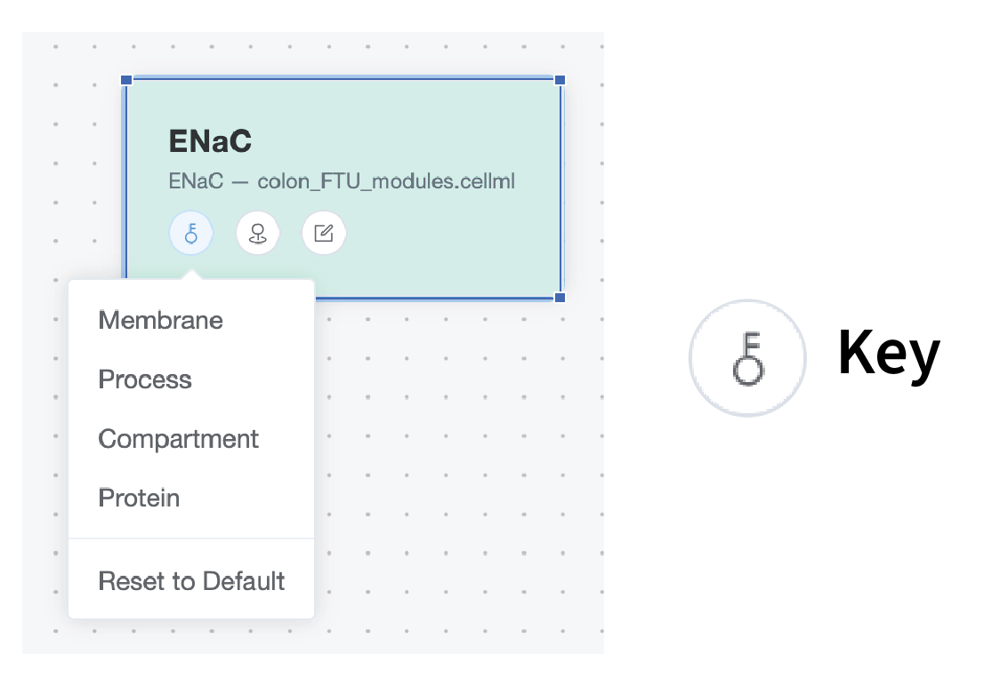

# Interface Overview

This page summarizes all user interface elements in the Workbench view of PhLynx.

## Workbench Overview

The Workbench is the primary interface for building and configuring models. It is divided into three main interaction areas:

* **[Toolbar](../reference/ui-overview#toolbar) (Top):** Tools for file management, importing/exporting, and general workspace operations.
* **[Module List](../reference/ui-overview#module-list) (Left):** A library of imported <GlossaryLink term="modules"/> available for use.
* **[Workspace](../reference/ui-overview#workspace) (Centre):** The canvas where you assemble, configure, and connect your model components.

These areas are highlighted in the image below:

{.align-center width="600px"}

---

## Toolbar

The toolbar provides essential controls for managing your project files and workspace state.

### File Management

#### Load Workspace
Restores a previously saved PhLynx workspace.
* **Action:** Opens a file dialog to select a `.json` workspace file.
* **Result:** Restores module positions, definitions, connections, and visual customizations (colors/names).

#### Save Workspace
Saves the current state of your project.
* **Action:** Downloads a `.json` file to your browser's default download folder.
* **Result:** Preserves the current workspace state for later restoration.

### Edit Operations

* **Undo (`Ctrl+Z`):** Reverses the last action.
* **Redo (`Ctrl+Shift+Z`):** Reapplies the last undone action.
* **Macro Build:** Enters the Macro Build component. See the [Macro Build Guide](../guides/macro-build-guide) for details.

### Import

The Import menu allows you to bring various file types into PhLynx.

#### 1. Vessel Array
Populates the workspace using a [vessel array](./file-types#vessel-array) file.
* **Supported Format:** `.csv`
* **Result:** Automatically populates the workspace with configured and connected modules based on the array definition.

> [!NOTE]
> If PhLynx does not recognize vessel types within the array, you may be prompted to provide additional module files.

#### 2. Modules
Imports [CellML](./cellml-module-format) components to the Module List.
* **Supported Format:** `.cellml`
* **Result:** Adds all components found in the file to the **Module List** panel, making them available for placement.

#### 3. Module Configurations
Imports [Module Configuration](./file-types#module-configuration) files to update internal definitions.
* **Supported Format:** `.json`
* **Result:** Updates the configuration parameters of modules in the internal store.

#### 4. Parameters
Imports a parameter file to identify constants and global constants. *(Marked for Deprecation)*
* **Supported Format:** `.csv` (Circulatory Autogen parameter format)
* **Result:** Categorizes variables properly during export.
* **Naming Convention:**
    * Constants: `[module_name]_[parameter_name]`
    * Global Constants: `[parameter_name]`

#### 5. Units
Imports a [Units](./cellml-units-file) definition file.
* **Supported Format:** `.cellml`
* **Result:** Updates unit definitions in the internal store.

### Export

Generates output files for Circulatory Autogen or standard CellML.

> [!NOTE]
> Chrome users will be prompted to select a save location upon export. Other browsers may default to the Downloads folder.

| Export Type | Output Content | Requirements |
| :--- | :--- | :--- |
| **Configuration Files** | A `.zip` archive containing: • `vessel_array.csv` (connections) • `module_config.json` (parameters/ports) | • At least one module in workspace • Parameter file loaded • Ports defined for connections |
| **CellML Model** | A flattened CellML 2.0 model file. | • At least one module in workspace • Ports defined for connections • All units defined |

---

## Module List

The Module List panel (left) displays all CellML components available for your model.

**Features:**
* **Collapsible Sections:** Click module headers to expand or collapse groups of components from the same source file.
* **Drag and Drop:** Click and drag any item from the list onto the **Workspace** to add it to your model.
* **Visual ID:** Components maintain the names defined in their source CellML files.

---

## Workspace

The central canvas where model assembly takes place.

**Navigation & Interaction:**
* **Pan:** Click and drag on empty space to move the view.
* **Zoom:** Use the mouse wheel or trackpad to zoom in/out.
* **Select:** Click a module to select it; hold `Ctrl` (or `Cmd`) to select multiple.
* **Area Select:** Hold `Shift` and drag to create a selection box.
* **Connect:** Click and drag from a module's **Port Node** to another module to create a connection.

### Control Bar
Located in the bottom-left corner, the Control Bar offers quick access to view settings:
1.  **Zoom In**
2.  **Zoom Out**
3.  **Zoom to Fit:** Centers all modules in the view.
4.  **Lock Workspace:** Prevents accidental movement of modules.
5.  **Screenshot:** Captures an image of the current view.

---

## Module Nodes

A Module Node is the visual representation of a CellML module within the workspace. It displays the editable module name (exported as `vessel_name`) and its origin component.

Each node features three interactive tools for configuration:

{.align-center width="600px"}

### 1. Key (Colour Selector)
* **Icon:** Key (Left)
* **Purpose:** Assigns a color category to the module for visual organization. These colors do not affect export functionality.
* **Options:** Membrane (Pink), Process (Blue), Compartment (Orange), Protein (Green).

{.align-center width="300px"}

### 2. Add Port Node
* **Icon:** Pin (Centre)
* **Purpose:** Adds a connection point (Port Node) to the edge of the module.
* **Usage:** Click the icon, then select a direction (Top, Right, Bottom, Left) from the menu. You can add multiple ports to a single module.

{.align-center width="600px"}

### 3. Edit Module
* **Icon:** Pencil (Right)
* **Purpose:** Opens the **Edit Module Dialog** to rename the module and configure port variables.

---

### Edit Module Dialog

This dialog allows for detailed configuration of the module's properties and data mappings.

{.align-center width="600px"}

#### Module Name
Sets the unique identifier for the module in exported files.
* **Requirement:** Must be unique within the workspace.

#### Port Definitions
Maps specific CellML variables to the visual ports created on the module node.

1.  **Port Type:** Use the dropdown to select one of I (input), O (output), and G (general) to set the port type. 
2.  **Port Name:** Enter a custom name for the shared variable (e.g., `sodium_concentration`). This acts as the "common language" between connected modules.
3.  **Variable Selection:** Use the dropdown to select one or more internal CellML variables to expose through this port.
4.  **Manage Ports:**
    * **Add Port:** Adds a new definition row.
    * **Delete:** Removes a definition row.

**Controls:**
* **Save:** Applies changes and closes the dialog (`Enter`).
* **Cancel:** Discards changes.

---

## Connections

Connections define how data is shared between modules.

### Port Nodes
Small circular nodes added to the edge of a module.
* **Create:** Use the **Add Port Node** (Pin) tool on a module.
* **Delete:** Hover over a port node and click the **Trash** icon.
    > [!WARNING]
    > Deleting a port node will also delete all arrows connected to it.

### Connection Arrows
Lines indicating a shared variable relationship between two modules.
* **Create:** Click and drag from one Port Node to another. The target node will highlight when a valid connection can be made.
* **Direction:** The arrow points to the "destination" module. This directionality is used specifically for vessel array file exports.
* **Delete:** Click the arrow to select it, then press `Delete`.

---

## Shortcuts & Selection

### Selection Tools

| Action | Command | Result |
| :--- | :--- | :--- |
| **Single Select** | Click Module | Selects one module. |
| **Multi-Select (Click)** | `Ctrl` + Click (Win/Linux) `Cmd` + Click (Mac) | Adds module to current selection. |
| **Multi-Select (Area)** | `Shift` + Drag | Selects all modules within the drawn box. |

### Keyboard Shortcuts

| Action | Shortcut |
| :--- | :--- |
| **Delete Selection** | `Delete` or `Backspace` |
| **Undo** | `Ctrl` + `Z` |
| **Redo** | `Ctrl` + `Shift` + `Z` |
| **Rename Module** | Double-click module name |
| **Save Dialog Changes** | `Enter` |